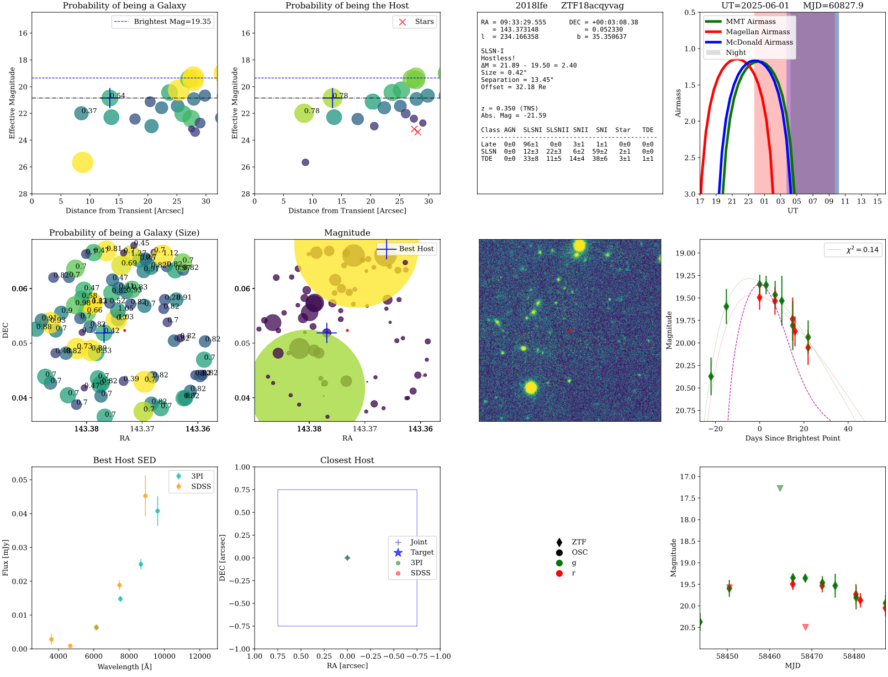

.. _usage:

Usage
=====

Basic Usage
-----------

The simplest way to use ``fleet`` is through the main ``predict`` function:

.. code-block:: python

    from fleet.classify import predict
    results = predict("2021zcl")

This function will produce an output diagnosis plot with all necessary information:

   **Prediction for 2018lfe.** Example of a FLEET prediction plot for 2018lfe.

* The first panel shows the probability of each object in the field of being a galaxy (coded by color and size), with the most likely host galaxy highlighed with a cross. The best host and the closest host show the proability of being a host galaxy as values on top of them.
* The second panel shows the probability of each object in the field to be the host of the transient (coded by color and size), with the most likely host galaxy highlighted with a cross. Objects that are deemed to be stars are shown as red crosses.
* The third panel shows general inforamation about the transient such as: Coordinates, redshift, classification, size of host galaxy, separation between transinet and host galaxy, and the actual probabilities from FLEET.
* The fourth panel shows the visibility of the transient from MMT, Magellan, and McDonald telescopes at the time the function was run, saved in the title.
* The fifth panel shows the nearest sources to the transient in the sky, each number represents the size of each object in arcseconds, and the color represents the probability of being a host galaxy. The size of the red star represents the magnitude of the transient.
* The sixth panel shows the nearest sources to the transient in the sky, the color and size represents the magnitude of each object. The most likely host galaxy is highlighted with a cross. The size of the red star represents the magnitude of the transient.
* The seventh panel shows the PanSTARRS image of the field of the transient, with the location of the transient marked with a red star.
* The eigth panel shows the light curve of the transient, with the best fit model from FLEET. The purple dashed line represents a typical Type Ia SN light curve for reference.
* The ninth panel shows an SED of the best host galaxy with photometry from PanSTARRS and SDSS.
* The tenth panel shows a zoom-in to the location of the most likely host galaxy, with the transient location marked with a blue star.
* The eleventh panel shows the legend from the light curve, and where the photometry comes from.
* The twelfth panel shows the same light curve as the eigth panel, but zoomed out to show the full dataset.

Typical Usage
-------------

There are several ways to use FLEET and a variety of keys that can be modified. To see the full list of keys and their descriptions we direct you to the docstring of the ``predict`` function. Here is a modified version that one might
use if you already know the object name, coordinates, classification, and redshift of the transient you want to classify. This can be done with ``query_tns = False`` to save on doing that query. If no coordinates are specified, FLEET will
always query TNS.

Similarly, if there is a light curve already available in the ``lightcurve`` directory, you can set ``read_existing = True`` to use that light curve instead of re-generating it. Also, if you do not wish to re-query Alerce to download
the light curve, you can set ``download_ztf = False``. If there is no data available in either ``ztf``, ``osc``, or ``local``, then even if ``download_ztf = False``, FLEET will force the download of the light curve from Alerce.

Setting ``do_observability = False`` will not generate the observability plot, which can save some time if you are not interested in that information. Additionally, you can set ``include_het = True`` if you want to calculate the observability
for the Hobby-Eberly Telescope (HET) specifically, which is very time consuming.

If you are running this on many objects, I suggest you set ``emcee_progress = False`` to avoid the progress bar from showing up for every single object, which can get cluttery.

.. code-block:: python

    from fleet.classify import predict

    results = predict(object_name_in='2018lfe', ra_in=143.373148152, dec_in=0.0523300756855,
                      object_class_in='SLSN-I', redshift_in=0.35,
                      model='full', query_tns=False, do_observability=False, classify=True,
                      download_ztf=True, read_existing=False, emcee_progress=False,
                      plot_output=False, params_dir='output_test')

Output
------

The ``results`` returned by ``create_info_table`` is an Astropy table containing a comprehensive set of columns (keys) that capture every piece of information about the transient, its light curve, its host, input parameters, classification probabilities, and (optionally) observability. Below is a breakdown of all columns you will find in `info_table`, grouped by category.
The key classification indicators are ``P_late_SLSNI`` and ``P_late_SLSNI_std`` or ``P_late_TDE`` and ``P_late_TDE_std``, which give the probability for the transient to be either a SLSN or a TDE, respectively, along with the uncertainty in that classification.

Input Parameters
^^^^^^^^^^^^^^^^

Every key in the original ``parameters`` dictionary passed to ``create_info_table`` becomes a column (with a one‐element list) in ``info_table``. Some of them include:

* **object_name_in**: the user‐specified object name (e.g. `"2018lfe"`)
* **ra_in**, **`dec_in**: the input coordinates (in decimal degrees)
* **object_class_in**: the user‐provided classification label (e.g. `"SLSN-I"`)
* **redshift_in**: redshift value (float)
* **acceptance_radius**: search cone radius used when querying catalogs in arcminutes

Light‐Curve Summary Statistics
^^^^^^^^^^^^^^^^^^^^^^^^^^^^^^

* **lc_length** : total number of photometric entries in the light curve.
* **det_length** : number of detections (i.e. where `UL == False` and `Ignore == False`).
* **used_length** : number of detections within the specified phase window (`phase_boom` is between `phase_min` and `phase_max`).
* **time_span** : the span in days between the earliest and latest detection (`MJD[max] – MJD[min]`).

Host Galaxy Properties
^^^^^^^^^^^^^^^^^^^^^^

* **num_sources** : total number of sources retrieved in the field
* **has_sdss** : `True` if SDSS columns were present.
* **has_psst** : `True` if PanSTARRS columns were present.
* **host_radius** : half‐light radius of the best host galaxy (arcsec)
* **host_separation** : separation between transient and best host (arcsec)
* **host_ra`, `host_dec** : coordinates of best host
* **host_Pcc** : chance‐coincidence probability for best host
* **host_magnitude** : (effective) magnitude of best host
* **host_magnitude_g`, `host_magnitude_r** : host magnitudes in g/r bands
* **host_nature** : “galaxyness” score (e.g. probability of being a galaxy)
* **closest_separation**: separation of the nearest source (arcsec)
* **closest_nature**: galactocentric score of that nearest source
* **closest_magnitude**: effective magnitude of nearest source
* **closest_magnitude_g`, `closest_magnitude_r**: nearest source’s g/r mags
* **star_separation**: separation threshold used to distinguish stars from galaxies (arcsec)
* **star_cut**: magnitude threshold used to distinguish stars from galaxies (mag)
* **Pcc_filter**: chance‐coincidence probability threshold used to filter out sources
* **Pcc_filter_alternative**: alternative chance‐coincidence probability threshold used to filter out sources
* **neighbors**: number of neighbors within the `acceptance_radius`

Timing and Color Features
^^^^^^^^^^^^^^^^^^^^^^^^^

Additional photometric features included via keyword arguments:

* **bright_mjd**: MJD of the brightest detection in the light curve
* **first_mjd**: MJD of the first detection in the light curve
* **delta_time**: difference between `bright_mjd` and `first_mjd`
* **color_peak**: color (e.g. g–r) at peak brightness
* **late_color**: color at late phases (e.g. g–r at 60 days)
* **late_color10**, `late_color20`, `late_color40`, `late_color60` – colors at 10, 20, 40, and 60 days after peak
* **first_to_peak_r**, `first_to_peak_g` – days from first detection to r‐band/g‐band peak
* **peak_to_last_r**, `peak_to_last_g` – days from r‐band/g‐band peak to last detection
* **brightest_mag**: brightest (lowest) observed magnitude in the light curve
* **green_brightest**, `red_brightest` – peak magnitudes in green and red filters
* **chi2**: reduced χ² of the light‐curve fit

Model Fitting Parameters
^^^^^^^^^^^^^^^^^^^^^^^^

These depend on the model chosen, by default ``model='full'``.

* **lc_width**: width of the light curve (e.g. in days)
* **lc_decline**: decline rate of the light curve (e.g. in magnitudes per day)
* **phase_offset**: phase offset applied to the light curve
* **mag_offset**: magnitude offset applied to the light curve
* **initial_temp**: initial temperature of the blackbody model (if applicable)
* **cooling_rate**: cooling rate of the blackbody model (if applicable)

Classification Probabilities
^^^^^^^^^^^^^^^^^^^^^^^^^^^^

The classification probabilities are generated by the random forest classifiers trained on the light‐curve and host features. The output table contains multiple columns for each classifier, with the main focus on the late‐time SLSN-I and TDE classifications.

* **P_late_SLSNI**: probability that the transient is a SLSN-I based on late‐time features
* **P_late_SLSNI_std**: standard deviation of the SLSN-I probability across the ensemble of classifiers

We recommend sticked with the ``late`` probabilities as opposed to the ``rapid`` ones.
For each of these, *all* class labels (`['AGN','SLSNI','SLSNII','SNII','SNIIb','SNIIn','SNIa','SNIbc','Star','TDE']`) get both a probability and a standard deviation column. In particular:&#x20;

Observability Flags
^^^^^^^^^^^^^^^^^^^
* **MMT_observable**: `True` if the transient is observable from MMT (airmass < 2.0, Sun < –18°)
* **Magellan_observable**: `True` if observable from Magellan
* **McDonald_observable**: `True` if observable from McDonald

